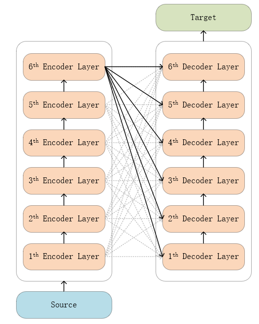
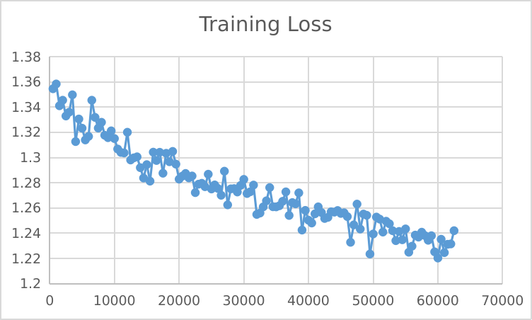

## 1-th experiment：Modify model structure-1

### Model structure

  

As shown in the figure, there is a 3072 * 512 fully connected layer between the Encoder and Decoder layers. The input of the fully connected layer is the output of the 6 Encoder layers, and the output is used as the input of the Decoder layer. In this experiment, the fully connected layer was initialized to the original Transformer structure.

### Experiment details

1. 100w/450+w train datasets
2. batch_size = 16
3. epoch = 1
4. The output of the 6 encoder layers is used as the fully connected input, and the output is used as the decoder input, that is, 3072 * 512, initialized to last_hidden_state 

__After fine-tuning__

'eval_loss': 1.3364245891571045, 

'eval_bleu': 33.5984,

In principle, at least this solution will not get worse, but the results get worse after fine-tuning, which may be due to overfitting. 

### tips:Due to the author's error, the fine-tuned model was not saved in this experiment.