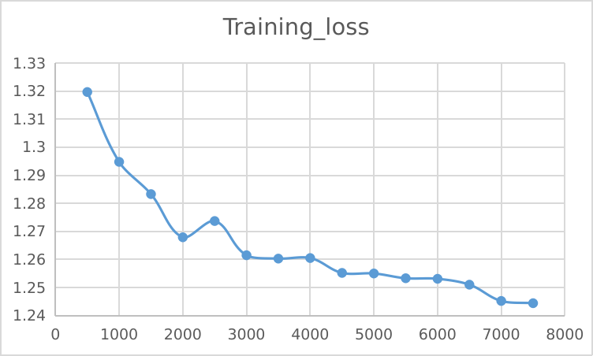

## TODO: Update model file link

## 2-th experiment：Fine-tune the original model

### model file： 

1. 100w/450+w train datasets
2. batch_size = 128
3. epoch = 1

__After fine-tuning__

'eval_loss': 1.1815344095230103, 

'eval_bleu': 36.4331,
