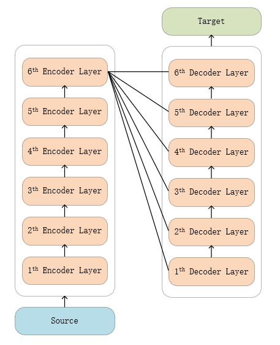
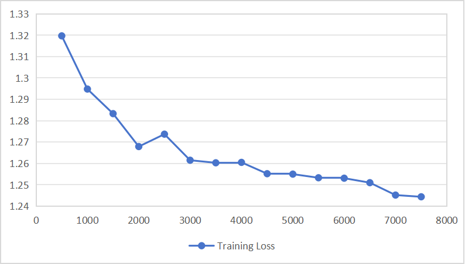

## TODO: Update model file link

## 2-th experiment：Fine-tune the original model

### Model structure

  

As shown in the figure, no model structure was modified in this experiment, that is, the output of the last Encoder layer was used as the input of each Decoder layer.

### Experiment details

1. 100w/450+w train datasets
2. batch_size = 128
3. epoch = 1

__After fine-tuning__

'eval_loss': 1.1815344095230103, 

'eval_bleu': 36.4331,
