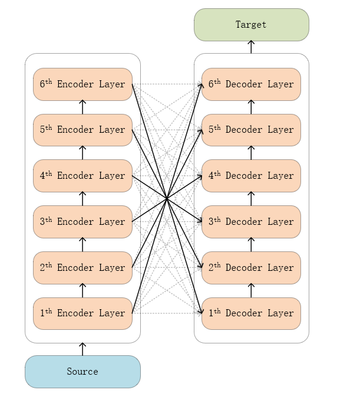
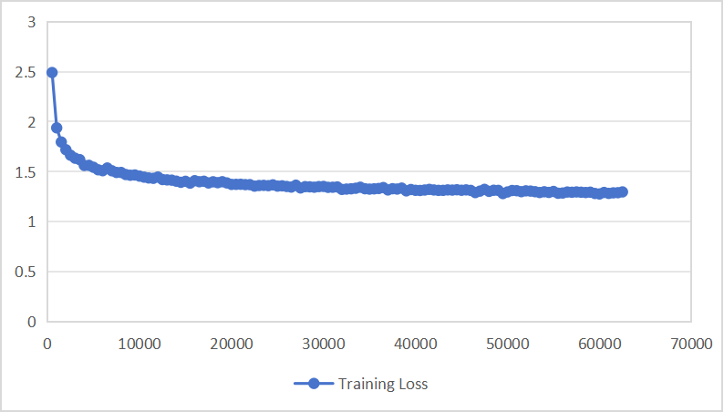

## TODO: Analyze weight images, Update model file link

## 3-th experiment：Modify model structure-2

### Model structure

  

As shown in the figure, the fully connected layer is the same as 1-th_experiment, initialized to Granularity Consistent Attention.

### Experiment details

1. 100w/450+w train datasets
2. batch_size = 16
3. epoch = 1
4. Same as test1, initialized to Granularity Consistent Attention

__initial loss and bleu__

'eval_loss': 8.379070281982422, 

'eval_bleu': 0.004,

__After fine-tuning__

'eval_loss': 1.4602397680282593,, 

'eval_bleu': 32.1451,,

The original model is trained according to the standard Transformer structure. Since the fine-tuning structure is different from the pre-training structure, it has a greater impact. However, the performance after fine-tuning is relatively good and the convergence speed is fast, so this solution may be better.
