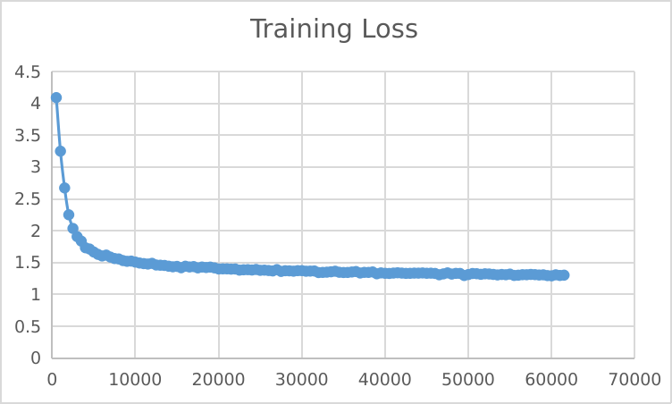

## TODO: Analyze weight images, Update model file link

## 3-th experiment：Modify model structure-2

### model file： 

1. 100w/450+w train datasets
2. batch_size = 16
3. epoch = 1
4. Same as test1, initialized to Granularity Consistent Attention

__initial loss and bleu__

'eval_loss': 8.379070281982422, 

'eval_bleu': 0.004,

__After fine-tuning__

'eval_loss': 1.5140511989593506, 

'eval_bleu': 30.7951,

The original model is trained according to the standard Transformer structure. Since the fine-tuning structure is different from the pre-training structure, it has a greater impact. However, the performance after fine-tuning is relatively good and the convergence speed is fast, so this solution may be better.