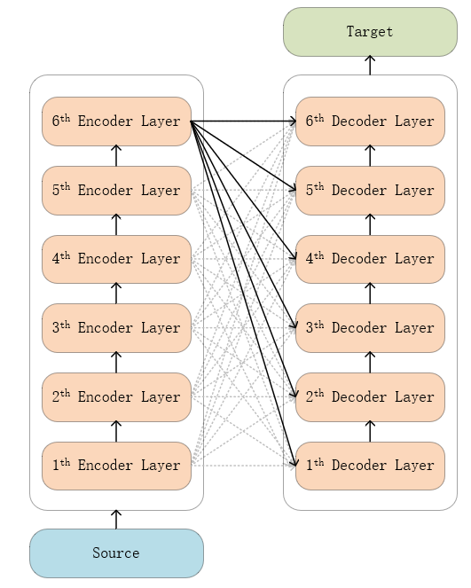

## TODO: Further analysis

## 4-th experiment：Modify model structure-1

### Model structure

  

As shown in the figure, the fully connected layer is the same as 1th experiment, Unlike the 1th experiment, this experiment did not use pre-training weights and restarted the training.

### Experiment details

1. 100w/450+w train datasets
2. batch_size = 16
3. epoch = 1

 Training Loss  

__initial loss and bleu__

'eval_loss': 124.3712158203125, 

'eval_bleu': 0.0,

__After fine-tuning__

'eval_loss': 11.015151977539062, 

'eval_bleu': 0.0003,

Since only 1 epoch was performed and the training data was a quarter of the entire training set, the effect was not good. But this is just the beginning, and the training will continue.

Observing the Training Loss, it can be found that the model converges slowly, which may be due to the defects of this structure itself, or it may be due to the fact that the training set is too small.